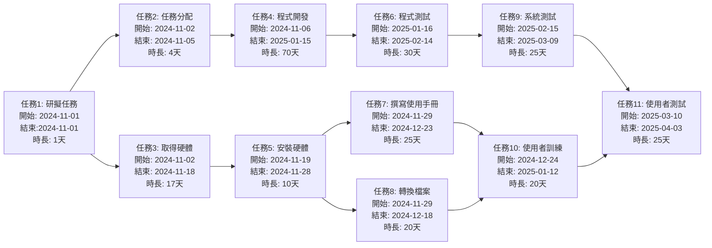
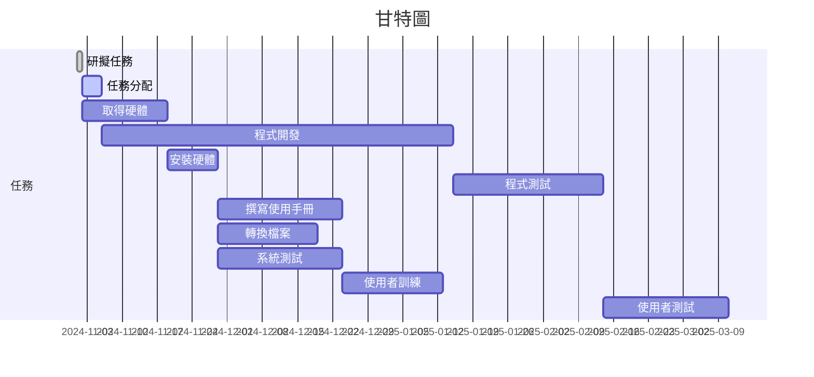

# hw2
| 任務 | 說明           | 需時(天) | 前置任務    | 開始時間 | 結束時間 |               
|:------:|:----------------:|:----------:|:--------------:|:----------:|:----------:|
| 1    | 研擬計畫       | 1        | -           | 第1天    | 第1天    |                
| 2    | 任務分配       | 4        | 1            | 第2天    | 第5天    |                    
| 3    | 取得硬體       | 17       | 1            | 第2天    | 第18天   |                     
| 4    | 程式開發       | 70       | 2            | 第6天    | 第75天   |                     
| 5    | 安裝硬體       | 10       | 3            | 第19天   | 第28天   |                     
| 6    | 程式測試       | 30       | 4            | 第76天   | 第105天  |                     
| 7    | 撰寫使用手冊   | 25       | 5            | 第29天   | 第53天   |                     
| 8    | 轉換檔案       | 20       | 5            | 第29天   | 第48天   |                     
| 9    | 系統測試       | 25       | 6            | 第106天  | 第130天  |                     
| 10   | 使用者訓練     | 20       | 7, 8      | 第54天   | 第73天   |                     
| 11   | 使用者測試     | 25       | 9, 10      | 第131天  | 第155天  |                   

PERT/CPM圖




```
關鍵路徑(任務):1、2、4、6、9、11
```

